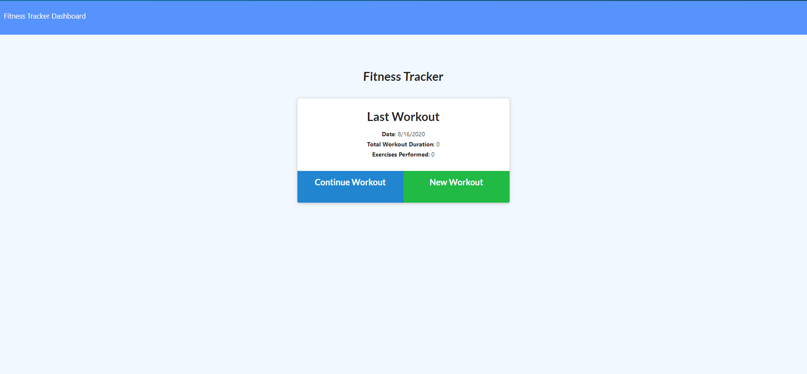

# Fitness Tracker

[Repo: Fitness Tracker](https://github.com/Jones-M12/Fitness-Tracker)

[Deployed Site: Fitness Tracker Jones](https://fitness-tracker-jones.herokuapp.com/)

## Overview

A dynamic fitness application built to support individuals that want to support for track fitness exercises.

## User Story

As a USER.

I WANT to be able to save and keep track of workout session

SO THAT I can meet weight loss goals.

## Development 

Created the backend of a Fitness Tracker using Mongo and deployed on heroku with Atlas. Implemeted with a Mongoose schema and handle routes and Express.

* Main Home Screen

Demo of how application works:

* Click New Workout to add a workout

* Click Add Exercise to add to the list

* Then Click Complete to return to the main page

* Click Continue Workout to add on to an exercise that has already been added

* Click Add Exercise to add to the list

* Then Click Complete to return to the main page

* Click Fitness Tracker Dashboard to see exercise tracking trends

## Contact Information

* GitHub: [Jones-M12](https://github.com/Jones-M12) 

* Email: malesharj@gmail.com 

* LinkedIn: [m-jones89](https://www.linkedin.com/in/m-jones89/)
